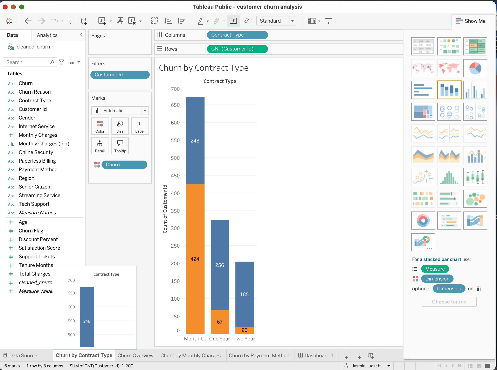
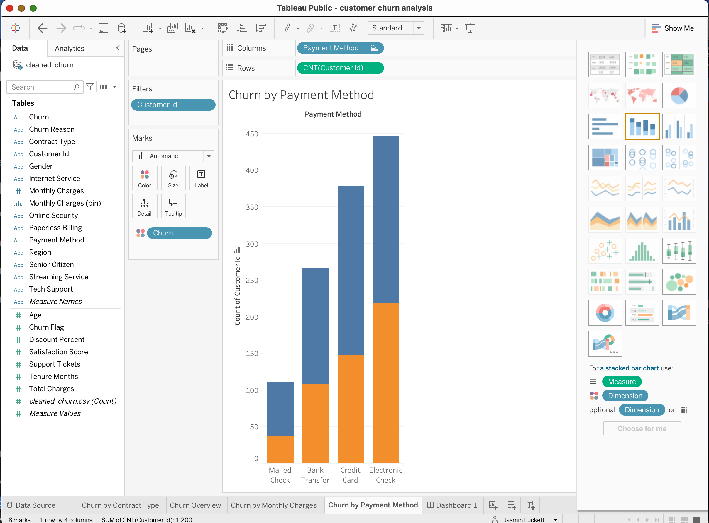
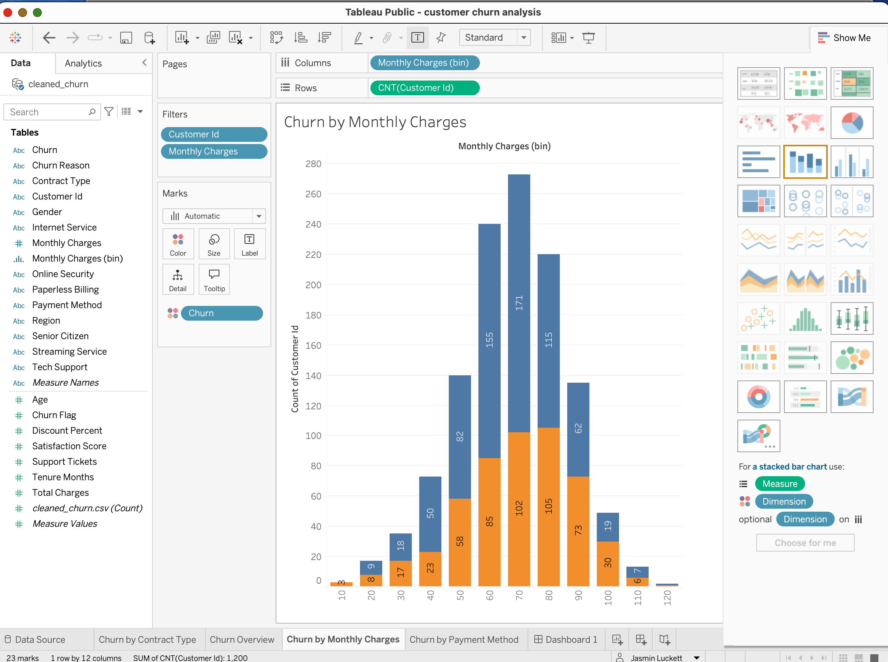

# 📊 Customer Churn Analysis Dashboard

## 🔍 Overview

This project analyzes customer churn using Python, SQL, and Tableau to identify patterns in customer behavior and improve retention strategies.

---

## 🛠 Tech Stack

* Python (Pandas)
* SQL (SQLite)
* Tableau Public
* Git & GitHub

---

## 📂 Project Structure

* `data/` → Raw and cleaned datasets
* `python/` → Data cleaning script
* `sql/` → SQL queries
* `screenshots/` → Dashboard visuals

---

## 📊 Key Insights

* Customers with **month-to-month contracts** churn the most
* **Electronic check payments** have higher churn rates
* Higher **monthly charges** increase churn risk
* **Long-term contracts** improve retention

---

## 📈 Dashboard

### Churn by Contract Type

### Churn by Payment Method

### Churn by Monthly Charges

---

## 💡 Recommendations

* Offer incentives for long-term contracts
* Improve retention for high-paying customers
* Encourage alternative payment methods
* Enhance customer support experience

---

## 🔗 Live Dashboard

## 🔗 Live Dashboard
👉 https://public.tableau.com/views/customerchurnanalysis_17770715753810/Dashboard1

---

## 👩🏽‍💻 Author

Jasmin Luckett
